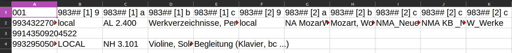

# Marc XML to table converter

Librarians may want to list and explore Marc 21 fields in a tabular format. `marcxml2table.py` converts Marc XML data into a tab separated values table where every subfield is a separate column and every record a row of data.

# Usage

There is a `-h` switch to print a how-to-use message:

`python marcxml2table.py -h`

## Execution
`python marcxml2table.py marc.xml marc.tsv "001 035 85640"`

## Positional arguments

### marc.xml

A Marc XML file for input. It holds bibliographic, authorities or holdings records in `<record/>` elements. Often, Marc XML is created thru an Export job, which has no namespaces in it. *Currently, this script only looks for elements without any namespace.*

### marc.tsv

A tab separated values file to write the output to.

### List of fields to extract: "001 035 85640 983**a 98401abc"

A blank seperated list of fields to be converted. The LDR/Leader field should be written as `leader`.

To convert only Marc fields with specific indicators, use the five character notation. Add subfields after the 5-digit notation to limit output only for those subfields.

E.g., `85640` only outputs Marc 856 fields with first indicator = 4 and second indicator = 0.

E.g., `983**a` only outputs Marc 983 $a fields with any first and second indicator.

E.g., `98401abc` only outputs Marc 984 $a, $b, $c fields with with first indicator = 0 and second indicator = 1.


For any indicator, use an asterisk sign `*` as wildcard. For the blank indicator, use the hash sign `#`.

## Optional Argument

User the `--parse_hol` switch to parse Marx Holdings XML Data. Since Alma cannot Export Holdings Records, the REST API endpoint to retrieve full Holdings information should be used. See [download_holdings](#download-holdings) section.
# Example

* Sample input `sample_marc.xml` with isolated 001 and 983 fields:

```xml
<collection>
  <record>
    <controlfield tag="001">9934322704522</controlfield>
    <datafield ind1=" " ind2=" " tag="983">
      <subfield code="a">AL 2.400</subfield>
      <subfield code="b">Werkverzeichnisse, Personalbibliographien nach einzelnen Komponisten</subfield>
      <subfield code="9">local</subfield>
    </datafield>
    <datafield ind1=" " ind2=" " tag="983">
      <subfield code="a">NA MozarW</subfield>
      <subfield code="b">Mozart, Wolfgang Amadeus (1756-1791)</subfield>
      <subfield code="c">NMA_Neue Mozart Ausgabe</subfield>
      <subfield code="c">NMA KB _Neue Mozart Ausgabe/Kritische Berichte</subfield>
      <subfield code="c">W_Werke</subfield>
      <subfield code="9">local</subfield>
    </datafield>
  </record>
  <record>
    <controlfield tag="001">99143509204522</controlfield>
    <datafield ind1="N" ind2=" " tag="983">
      <subfield code="a">NH 5.200</subfield>
      <subfield code="b">Cembalo Solo: (nach Komponisten)</subfield>
      <subfield code="c">Klaviermusik bis 1750</subfield>
      <subfield code="c">Claviermusik bis 1750</subfield>
      <subfield code="9">local</subfield>
    </datafield>
  </record>
  <record>
    <controlfield tag="001">9932950504522</controlfield>
    <datafield ind1=" " ind2=" " tag="983">
      <subfield code="a">NH 3.101</subfield>
      <subfield code="b">Violine, Solo + Begleitung</subfield>
      <subfield code="c">Begleitung (Klavier, bc ...)</subfield>
      <subfield code="9">LOCAL</subfield>
    </datafield>
  </record>
</collection>
```

* We are only interested in Marc 983 with both indicators blank:

`python marcxml2table.py sample_marc.xml sample_marc.tsv "001 983##"`

* This generates the following data in `sample_marc.tsv`:

```
001	983## [1] 9	983## [1] a	983## [1] b	983## [1] c	983## [2] 9	983## [2] a	983## [2] b	983## [2] c	983## [2] c	983## [2] c
'9934322704522'	'local'	'AL 2.400'	'Werkverzeichnisse, Personalbibliographien nach einzelnen Komponisten'	''	'local'	'NA MozarW'	'Mozart, Wolfgang Amadeus (1756-1791)'	'NMA_Neue Mozart Ausgabe'	'NMA KB _Neue Mozart Ausgabe/Kritische Berichte'	'W_Werke'
'99143509204522'	''	''	''	''	''	''	''	''	''	''
'9932950504522'	'LOCAL'	'NH 3.101'	'Violine, Solo + Begleitung'	'Begleitung (Klavier, bc ...)'	''	''	''	''	''	''
```


* The table imported into LibreOffice Calc looks like this:



# Download Holdings

Use the `download_holdings` Bash script to get all Holdings Marc XML data in one file via REST API. For usage execute `download_holdings -h`

# Acknowledgement

Kudos to [gabriele-h](https://github.com/gabriele-h) - the general idea is taken from her [alma_export_extractor](https://github.com/gabriele-h/alma_export_extractor) project. Also, some code snippets were copy-pasted 🍝
